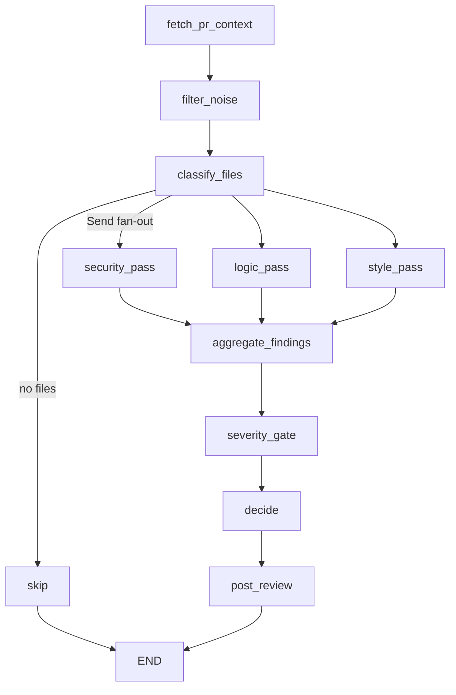

# CodeReviewer AI

Autonomous GitHub PR reviewer built with **Python · FastAPI · LangGraph · Groq**.

It receives pull request webhooks, parses the diff, fans changed files through
specialized security / logic / style passes, applies a confidence severity gate
to kill noise, and posts **one** inline review (never request-changes / approve).

**Live example:** [codereviewer-testbed#1](https://github.com/AizaAsim/codereviewer-testbed/pull/1)
— inline comment on the planted SQL-injection line with a structured finding.

---

## Why this exists

AI review bots are easy to demo and easy to make noisy. The hard part is staying
quiet on good code. This project treats noise as a first-class failure mode:

- confidence-gated severity filtering + per-line dedupe
- specialized passes so security does not “claim” logic bugs (and vice versa)
- measured quality on a hand-labeled buggy-PR set

### Evaluation (6 planted PRs × 3 trials)

| Metric | First eval (gate 0.7) | After lanes + gate 0.85 | After routing/prompt tune |
|---|---|---|---|
| Recall | 0.20±0.00 | 0.60±0.00 | **~1.00** (1-trial check) |
| Precision | 0.14±0.02 | 0.50±0.00 | **~0.83–1.00** |
| Clean-PR noise | 1.00±0.00 | **0.00±0.00** | **0.00** |

Raising the confidence cut from **0.7 → 0.85** cleared clean-PR noise.
A later pass fixed weak secret/style recall: config files always get a security
scan, low-risk helpers skip the logic pass, and style prompts explicitly cover
unused imports + PascalCase. Re-run `eval/run_eval.py` (3 trials) to refresh
the ±spread column before citing numbers externally.
Details: [`eval/README.md`](eval/README.md).

---

## Agent graph



Interesting decisions:

- **Map-reduce fan-out** with `Annotated[..., operator.add]` so parallel passes
  do not clobber each other’s findings
- **Severity gate** — drop confidence &lt; 0.85, drop docstring/blank-line noise,
  keep nits only when total findings &lt; 3, prefer security &gt; logic &gt; style on
  the same line
- **Routing** — config modules always get a security pass (hardcoded secrets);
  low-risk helpers skip the logic pass so invented correctness findings do not
  drown style nits
- **Token budgeting** before LLM passes under free-tier Groq limits
- **Idempotent runs** keyed on `(repo, pr, headSha)`
- **Fast-200 webhook** + background execution (survives Render free cold starts;
  GitHub retries + idempotency absorb the 10s timeout)
- **Per-comment 422 recovery** when GitHub rejects a bad line number
- **Multi-install** — webhook `installation.id` is threaded into GitHub auth so
  one App can review every repo it is installed on

---

## Install on your repos (Module 7)

1. Open the GitHub App’s public page → **Install** / **Configure**.
2. Add this repo, the testbed, and any other project you want reviewed
   (e.g. DeployMate).
3. Confirm the webhook URL is the Render service
   (`…/webhooks/github`). `GITHUB_INSTALLATION_ID` remains a fallback for
   eval/local; live webhooks prefer the payload’s `installation.id`.
4. Open a small PR and screenshot the best real review for the README.

---

## Stack

Python 3.12 · uv · FastAPI · LangGraph · langchain-groq (`llama-3.3-70b-versatile`)
· githubkit · unidiff · PostgreSQL · Alembic · Docker · Render (free)

---

## Local setup

1. Copy `.env.example` → `.env` and fill GitHub App + Groq values.
2. Put the App private key at `./github-app.private-key.pem` (gitignored).
3. Start Postgres + migrate + API:

```bash
docker compose up -d
make migrate
make dev
```

4. Tunnel webhooks (while iterating locally):

```bash
npx smee -u https://smee.io/YOUR_CHANNEL -t http://localhost:8000/webhooks/github
```

5. Manual GitHub client check:

```bash
TEST_PR_OWNER=AizaAsim TEST_PR_REPO=codereviewer-testbed TEST_PR_NUMBER=1 \
  uv run pytest tests/test_github_client_manual.py -m manual -s
```

### Eval harness

```bash
# .env must include EVAL_TOKEN=...
make dev   # terminal 1
export EVAL_TOKEN=... EVAL_BASE_URL=http://127.0.0.1:8000
uv run python eval/run_eval.py   # terminal 2
```

---

## Deploy on Render (Module 9)

1. Create a **Supabase** free Postgres (or any persistent Postgres). Copy the
   URI into `DATABASE_URL` (postgres:// is auto-normalized to
   `postgresql+psycopg://`).

   Use the **connection pooler** URI, not the direct one: Supabase's
   `db.<ref>.supabase.co` is IPv6-only and Render has no outbound IPv6, so
   direct connections fail with `Network is unreachable`. In Supabase →
   *Connect*, take the Session pooler string, which looks like

```
postgresql+psycopg://postgres.<project-ref>:<password>@aws-0-<region>.pooler.supabase.com:5432/postgres
```

   Percent-encode any special characters in the password (`@` → `%40`,
   `/` → `%2F`). Port `6543` (transaction mode) also works — prepared
   statements are disabled automatically for it.
2. Base64 the App private key (avoids Render newline mangling):

```bash
base64 -i github-app.private-key.pem | tr -d '\n' | pbcopy
```

3. New **Web Service** from this repo (or apply `render.yaml`):
   - Build: `curl -LsSf https://astral.sh/uv/install.sh | sh && export PATH="$HOME/.local/bin:$PATH" && uv sync --frozen`
   - Start: `export PATH="$HOME/.local/bin:$PATH" && uv run alembic upgrade head && uv run uvicorn codereviewer.main:app --host 0.0.0.0 --port $PORT`
4. Set env vars: `GITHUB_APP_ID`, `GITHUB_APP_PRIVATE_KEY_BASE64`,
   `GITHUB_WEBHOOK_SECRET`, `GITHUB_INSTALLATION_ID`, `GROQ_API_KEY`,
   `DATABASE_URL`, optional `EVAL_TOKEN`.
5. Point the GitHub App webhook URL to
   `https://YOUR-SERVICE.onrender.com/webhooks/github` (replace smee).
6. Hit `/health`. Redeliver a testbed PR webhook.

**Free-tier note:** Render sleeps after ~15 minutes idle. The first webhook
after sleep may exceed GitHub’s 10s ack window — the design already survives
that via fast-200 + GitHub retries + idempotent `(repo, pr, headSha)` runs.

---

## Project layout

```
src/codereviewer/
  webhooks/       HMAC + background enqueue
  github_client/  App auth, PR fetch, review post
  diff_engine/    pure parse / noise / budget
  agent/          LangGraph state, prompts, nodes
  persistence/    ReviewRun + Finding
  evalapi/        token-guarded /eval/review
eval/             labeled dataset + harness
```

---

## License

MIT (or your choice).
